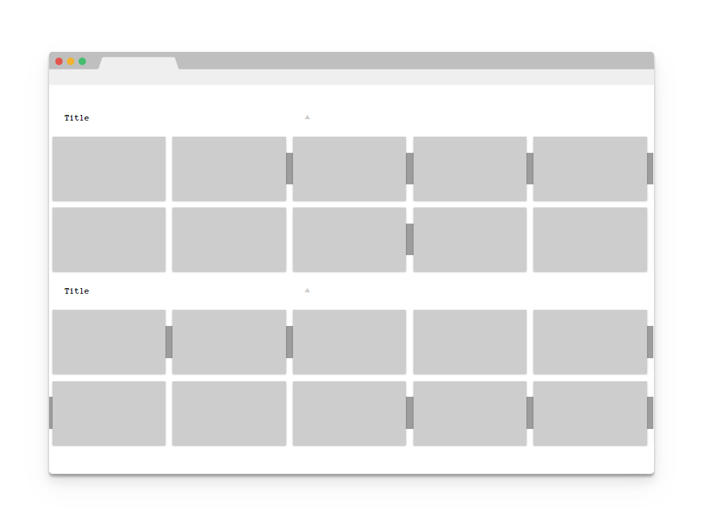
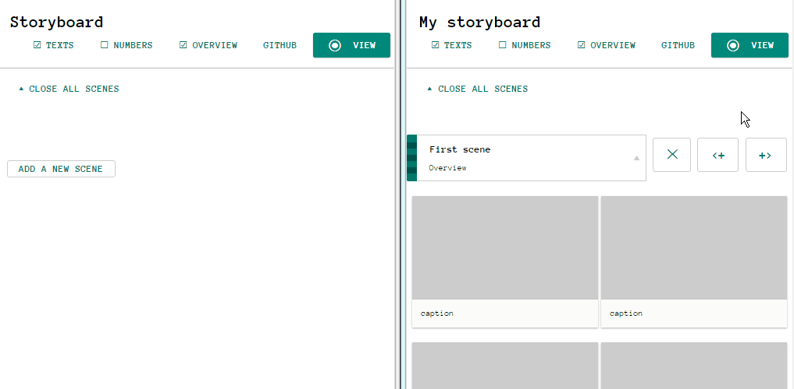

#Storynator

A simple storyboard editor, with drag and drop and direct text editing.

[][demo]

[demo]: https://cdn.rawgit.com/nliautaud/storynator/fbfe3e1b1d668f142ff11575469dfd542392ea09/story.html

### Features

- Drop images files.
- Direct text editing. Don't need to open Photoshop to edit a description or copy some text.
- Reorder things by drag & drop. Just move that shot before this one.
- Automatic numbering. Don't correct every shot numbers when you add an image.
- Responsive & dynamic layout. That's not your daddy PDF.
- Sharing & collaborating made easy. Send the file. Or synchronise things.
- Change the layout & design if you want. That's just HTML and CSS. 

### Getting started

Open the [demo][demo] and start editing.

When you're ready to save your changes, juste save the page (like just ``Ctrl+S`` or ``Cmd+S``). 

To continue editing, open the storyboard that you've just downloaded, edit-it and save-it again !

### Adding elements

In edit mode, you'll see some hollow blocs with dashed borders. They're new scenes and new frames waiting to be created. Start to edit them, and they will instantly became fresh new elements.

You can also drag an hollow element to somewhere you'd like a new one, or directly drop some images onto a hollow frame.

If you want to quickly add a bunch of empty frames, you may use the buttons next to the scene header. One append them at the end, and the other insert them at the begining (you don't have to scroll to the bottom for that).

By default, each frame define a distinct shot. By using the associated option of the frame overlay, you can define that a frame is part of the same shot than the previous one, and so define a shot illustrated by several frames. These relations are then displayed and numbered in a different manner.

To delete a scene, use the button next to its header.
By selecting a frame you'll reveal a delete button and some other options : 
- ``||`` or ``--`` to switch the link to the previous shot (see [shots](#shots))
- ``<==>`` to toggle the image width limitation (see [images](#images))

### Writing

The texts are directly editables.

Depending on your browser you may use the usual keyboard shortcuts to undo/redo text changes (ex. ``ctrl+z`` or ``⌘+z``) and apply formatting like bold, italic or underline (ex. ``ctrl+b`` or ``⌘+b``).

### Reorder frames and parts

Drag & drop things by grabbing the images or the handle next to the scenes titles.

You can move frames between scenes too. The relations between frames will be taken into account when moving them around :
- move all the frames of a shot by moving the first one
- move a frame to the head of its own shot by moving it before the first one
- insert a frame into an existing shot by moving it between the first and the last one
- extract a frame from a shot by moving it a little further

### Loading images

Drop image files onto a frame to load them. You may drop a single file to load or overwrite a single image, or drop a bunch of files to create new frames.

The image files must be in ``jpg``,``png`` or ``gif`` format. Once reduced to a proper size, they are directly included into the storyboard file.

The frames width are limited by default to be nicely layout in regular columns. When an image is especially larger than the others, for a traveling shot for exemple, that limitation may be inapropriated. The panoramic option available by selecting a frame allow an image to lock its height on the height of the surrounding frames. That option is automaticaly enabled when a dropped image is at least to times larger than tall.

### Shots

By default, each frame define a distinct shot.

By using the associated option of the frame overlay, you can define that a frame is part of the same shot than the previous one, and so define a shot illustrated by several frames. These relations are then displayed and numbered in a different manner.

The system helps maintaining such relations when moving frames around :
- you can move all the frames of a shot by moving the first one
- you can move a frame to the head of its own shot by moving it before the first one
- you can insert a frame into an existing shot by moving it between the first and the last one
- you can extract a frame of a shot by moving it a little further

### Display options

- *Open/close all* : toggle all the scenes.
- *Texts* : show / hide parts and frames texts.
- *Numbers* : show / hide parts and frames numbers.
- *Overview* : display frames two times smaller.
- *Edit/View* : toggle editing or viewing mode.

The parts may be folded or opened by clicking on the arrow next to their title.

### Sharing & copying

All you've got is composed of a .html file and a directory :

```
story.html
story_files/
```
The storyboard itself is self-contained in the single html file. That mean that it may be distributed, copied, sent by mail or synchronised trough Dropbox, BitSync, or shared on its own in any other way.

The sibling directory contain only the system files that allow to edit the storyboard content. Thus, a shared storyboard may be editable depending on whether you choose to include this directory or not. Note that its name rely on the browser and OS implementations, so different browsers and OS may have different behaviors and may use a slightly different name. 

A solitary storyboard file, without its sibling directory, will look like the view mode (without the edit button).

### Updating

The edit/view button is also an import/export tool which allow to copy the content of a storyboard file into another, and may be used as an easy update process.

Open the fresh new version of the [demo][demo] in a window, your storyboard in another one, and drag the edit button of your storyboard onto the edit button of the empty one.

[][demo]
