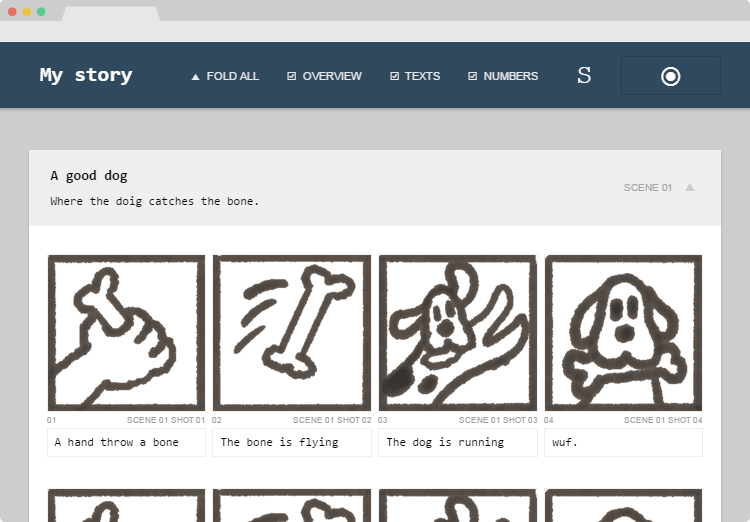
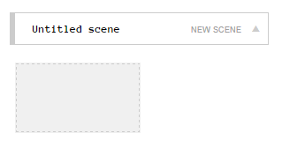
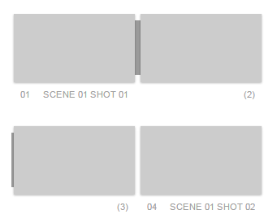

#Storynator

a simple storyboard editor

[Project page][website]

[][demo]

[demo]: https://rawgit.com/nliautaud/storynator/master/story.html
[github]: https://github.com/nliautaud/storynator/
[website]: https://nliautaud.github.io/storynator/

## 

Storynator is an autonomous tool and dynamic document which aims to simplify writing, browsing and editing a storyboard to stimulate collaboration, creative changes and structural experiments.

- Just drag & drop
- Click and write, load images and move things
- Filter elements, change the layout & search content
- Open it on any device & platform
- That's a simple file. Send it, copy it, synchronize it
- Feel free to do whatever you want with it

You want to contribute ? Help making this thing better by checking out the [GitHub repository][github] and submitting pull requests or reporting issues. Or you could just leave a message on ``tlk.io/storynator``.


## Getting started

Open the [demo][demo] and start editing. Everything takes place on your browser, and on your browser only, even when using the demo link : no single action (including loading images) is recorded, uploaded trough internet, nor stored anywhere.

When you're ready to save your changes, juste save the page on your computer (like just ``Ctrl+S`` or ``Cmd+S``). That saved file is autonomous, and may be opened from your computer, edited, and saved, again.

## Adding elements

In edit mode, you'll see some hollow blocs with dashed borders. They're new scenes and new frames waiting to be created. Start to edit them, and they will instantly became fresh new elements. Start to write some text, drag them to somewhere you'd like a new one, or just drop some images onto the hollow frames.



The scene header provide some buttons in edit mode :
- ``✕`` delete the scene
- ``<+`` insert a new frame at the begining of the scene
- ``+>` append a new frame at the end of the scene

You can select frames by clicking on the images (use the ``shift`` key to select multiple ones). The selected frames overlays several options :
- ``--`` link the selected frames to their predecessors
- ``⇔`` toggle the selected frames width limitation (see [images](#images))
- ``++`` duplicate the selected frames (you can use ``ctrl+d`` or ``⌘+d`` too)
- ``✕`` delete the selected frames (you can use the ``suppr`` shortcut too)

By default, each frame of the storyboard define a distinct shot. By linking a frame to its predecessor trough the frame options you define that it's still the same shot, and thus define a shot illustrated by several frames. The shots will be numbered accordingly, and may be displayed differently.



## Loading images

Drop image files onto a frame to load them. You may drop a single file to load or overwrite a single image, or drop a bunch of files to create new frames.

The image files must be in ``jpg``,``png`` or ``gif`` format. Once reduced to a proper size, they are directly included into the storyboard file.

By default, the frames width are set to be nicely layout in regular columns. When an image is especially larger than the others, for a traveling shot for example, that limitation may be inapropriated. By disabling that limitation trough the frames options, the image will mimic the height of its surrounding frames. That option is automaticaly enabled when a dropped image is at least two times larger than tall.

## Writing

The texts are directly editables.

Depending on your browser you may use the usual keyboard shortcuts to undo/redo text changes (ex. ``ctrl+z`` or ``⌘+z``) and apply formatting like bold, italic or underline (ex. ``ctrl+b`` or ``⌘+b``).

## Moving things

Drag & drop things by grabbing the images or the handle next to the scenes titles. You can move frames between scenes too.

You can only move the frames one by one, but moving the first one of a shot will move the other ones as well. The relations between frames will be taken into account when moving them around :
- moving a frame into an existing shot insert it as expected.
- extracting a frame from a shot by moving it further do not break the shot.
- moving a frame before the first one of its own shot will keep it in the shot.

## Display options

- *Open/close all* : toggle all the scenes.
- *Texts* : show / hide parts and frames texts.
- *Numbers* : show / hide parts and frames numbers.
- *Overview* : display frames two times smaller.
- *Edit/View* : toggle editing or viewing mode.

The parts may be folded or opened by clicking on the arrow next to their title.

## Sharing & copying

All you've got is composed of a .html file and a directory :

```
story.html
story_files/
```
The storyboard itself is self-contained in the single html file. That mean that it may be distributed, copied, sent by mail or synchronised trough Dropbox, BitSync, or shared on its own in any other way.

The sibling directory contain only the system files that allow to edit the storyboard content. Thus, a shared storyboard may be editable depending on whether you choose to include this directory or not. Note that its name rely on the browser and OS implementations, so different browsers and OS may have different behaviors and may use a slightly different name. 

A solitary storyboard file, without its sibling directory, will look like the view mode (without the edit button).

## Importing / exporting

You can import certain files by dropping them into the window. Dragging a storynator ``.html`` file would override the storyboard content, and dragging ``.css`` files would replace themes and translations. The file may also be appended by maintaining the ``shift`` key.

You can export an image by dragging it outside the browser window, on your desktop for example.

###  Content import & update

Appending storynator ``.html`` files with the ``shift`` key may be used to regroup several files into one, and overriding totally the storyboard content may be used as an easy update process :

- Open the [last version][demo] in your browser.
- Drag your existing storyboard file, for example ``my_story.html``, onto the empty one. The new document is filled with your storyboard content.
- Save that updated document onto the existing file, and open your local storyboard.

### Themes & translations

Storynator styles can be overridden by dropping ``.css`` files. The files names are prefixed by a namespace, allowing to drop different types of styles without overriding other types, for example switching translations without altering the theme. Example files can be found in the ``styles/`` directory of the repository.

The themes define the visual part of the storynator document and use the namespace ``theme``, for example ``theme.flat.css``. Appending trough the ``shift`` key may be used to apply theme variants, for exemple ``theme.flat-dark.css`` override only some color definitions of the flat theme.

The language files contains interface translations and use the namespace ``lang``, for example ``lang.en.css`` or ``lang.fr.css``. Indeed, all the storynator interface words and sentences are defined trough css pseudo-element ``::after`` or ``::before`` and thus may be changed with simple css rules, and even react to the system events. The english file should be used as reference. 

The style defined by the namespace ``_system`` manage the common mechanisms, the basic layout and assure a common base for themes. Included in every document, it should be edited for development purposes only.

To remove a style completely, override-it with an empty css file, for example ``theme.empty.css``.